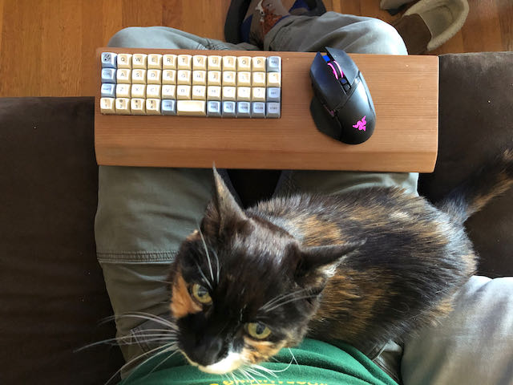

# Plank Planck Wireless Mod

A while ago I made a keyboard case for a Planck ortholinear mechanicalkeyboard out of a old redwood plank (a plank Planck!) with a big flat area for mousing. Good for couch gaming. Kind of like a home brew Razer Turret. Worked pretty well but very long USB cables only go so far.

Recently, the #zmk project and cheap tiny microcontrollers with onboard Bluetooth like the #nicenano are making custom wireless keyboards more accessible.

Now, the Plank has its MCU soldered in buuut it exposes handy contacts for the matrix. So! Some creative rewiring, some sharp chisels, a router plane, a custom 3D printed cover, and a bunch of hours where other people were holding the baby, and I’ve got myself a wireless ortholinear couch gaming keyboard.

# This Repo...

Has the model for the 3d printed cover/mcu mount. Enjoy! Woodworking, wiring, and zmk mods left as an exercise the reader.

# Assembly

1. Solder everything. Row and column headers to your choice of GPIO pins on the MCU. Bat+ and bat- to your battery. Some short leads to RST and GND.
2. Carve/route your mcu/wiring recess into your keyboard case. 
3. Trim some standard outdoor wood screws so they won't penetrate the top of the case (or, y'know, get the proper screws, but I had a ton of these!). Drill the appropriate pilot holes in your case.
4. Thread the mcu and wire bundle through the front of the case so it dangles out the back. 
5. Push a tactile switch in to the small hollow in the case so the legs penetrate the two holes (you may need to adjust the dimensions of this for the switches you have on hand).
6. Slide the wired-up MCU into the rails in the case 

Slide the wired 

# Gallery

